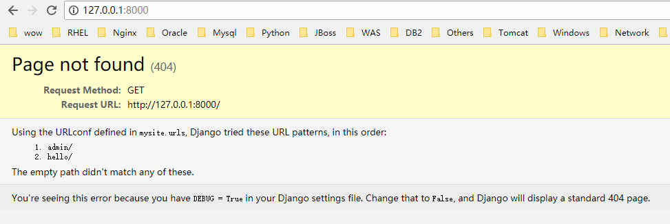

## 关于“404错误”的快速参考 

目前，我们的URLconf只定义了一个单独的URL模式： 处理URL /hello/ 。 当请求其他URL会怎么样呢？ 
让我们试试看，运行Django开发服务器并访问类似 http://127.0.0.1:8000/goodbye/ 或者 http://127.0.0.1:8000/hello/subdirectory/ ，甚至 http://127.0.0.1:8000/ (网站根目录)。 你将会看到一个 “Page not found” 页面。 因为你的URL申请在URLconf中没有定义，所以Django显示这条信息。 

