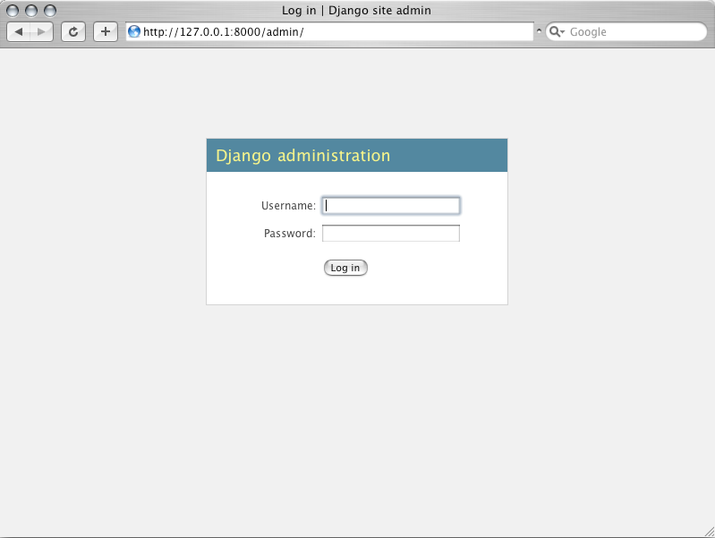
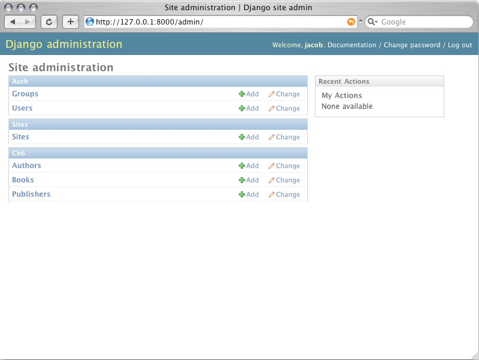
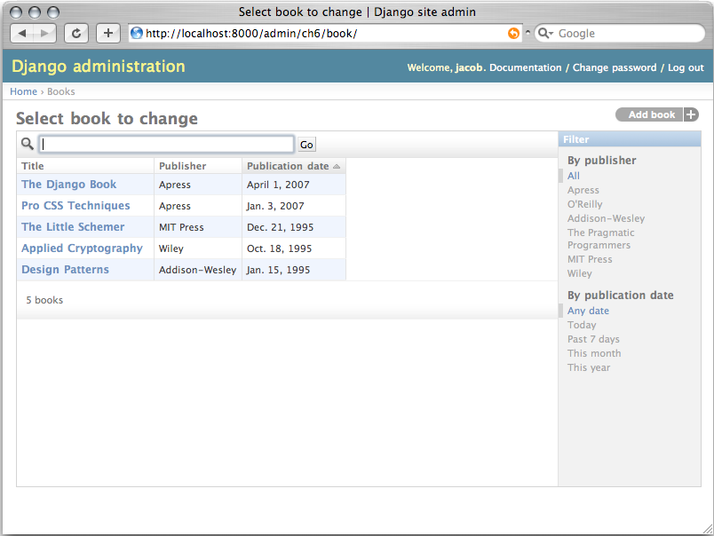
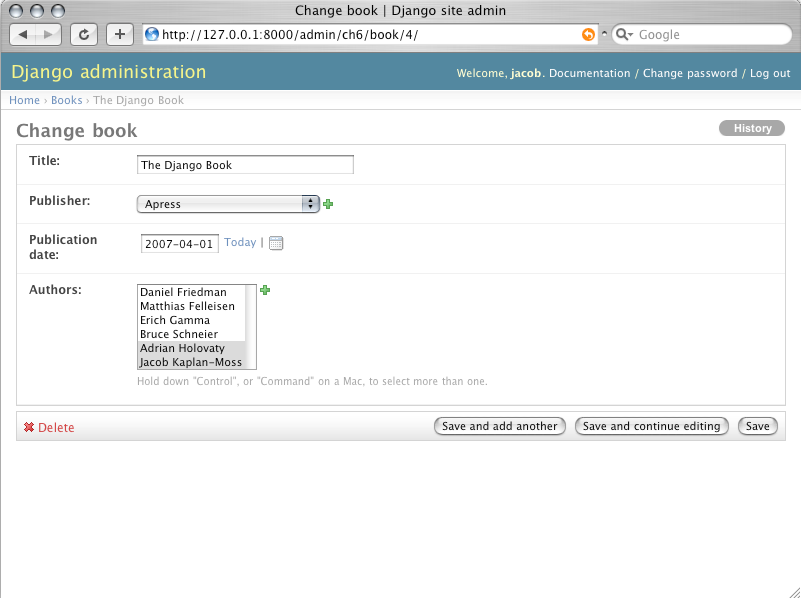
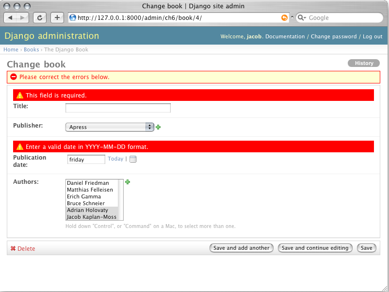
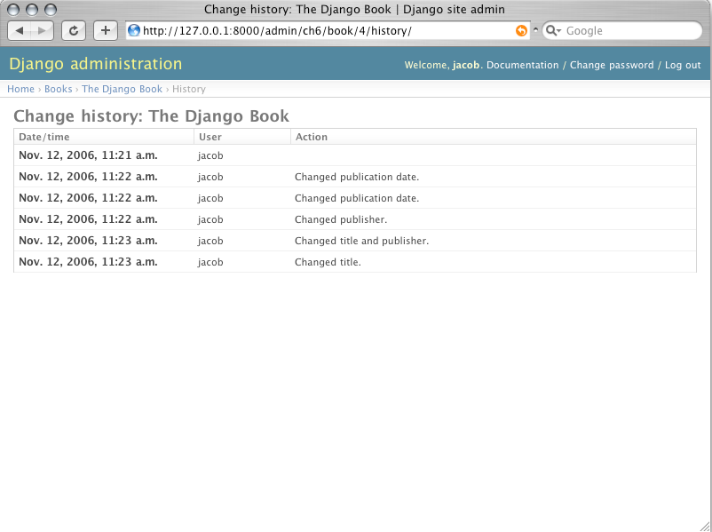

## 使用管理工具

管理界面的设计是针对非技术人员的，所以它应该是自我解释的。 尽管如此，这里简单介绍一下它的基本特性。 你看到的第一件事是如下图所示的登录屏幕。

你要使用你原来设置的超级用户的用户名和密码。如果无法登录，请运行`python manage.py createsuperuser` ，确保你已经创建了一个超级用户。

一旦登录了，你将看到管理页面。这个页面列出了管理工具中可编辑的所有数据类型。 现在，由于我们还没有创建任何模块，所以这个列表只有寥寥数条类目： 它仅有两个默认的管理-编辑模块：用户组(Groups)和用户(Users)。

在`Django`管理页面中，每一种数据类型都有一个`change list`和`edit form` 。前者显示数据库中所有的可用对象；后者可让你添加、更改和删除数据库中的某条记录。

关于其它语言， 如果你的母语不是英语，而你不想用它来配置你的浏览器，你可以做一个快速更改来观察`Django`管理工具是否被翻译成你想要的语言。 仅需添加`django.middleware.locale.LocaleMiddleware` 到`MIDDLEWARE_CLASSES` 设置中，并确保它在`django.contrib.sessions.middleware.SessionMiddleware` 之后 。（见上） 

完成后，请刷新页面。 如果你设置的语言可用，一系列的链接文字将被显示成这种语言。这些文字包括页面顶端的`Change password`和`Log out`，页面中部的`Groups`和`Users`。 `Django`自带了多种语言的翻译。

关于`Django`更多的国际化特性，请参见第十九章。

点击`Uers`行中的`Change`链接，引导用户更改列表。

这个页面显示了数据库中所有的用户。你可以将它看作是一个漂亮的网页版查询：`SELECT * FROM auth_user;` 如果你一直跟着作练习，并且只添加了一个用户，你会在这个页面中看到一个用户。但是如果你添加了多个用户，你会发现页面中还有过滤器、排序和查询框。 过滤器在右边；排序功能可通过点击列头查看；查询框在页面顶部，它允许你通过用户名查询。
点击其中一个用户名，你会看见关于这个用户的编辑窗口。

这个页面允许你修改用户的属性，如姓名和权限。（如果要更改用户密码，你必须点击密码字段下的`change password form`，而不是直接更改字段值中的哈西码。）另外需要注意的是，不同类型的字段会用不同的窗口控件显示。例如，日期/时间型用日历控件，布尔型用复选框，字符型用简单文本框显示。 你可以通过点击编辑页面下方的删除按钮来删除一条记录。 你会见到一个确认页面。有时候，它会显示有哪些关联的对象将会一并被删除。 （例如，如果你要删除一个出版社，它下面所有的图书也将被删除。） 你可以通过点击管理主页面中某个对象的`Add`来添加一条新记录。 一个空白记录的页面将被打开，等待你填充。 你还能看到管理界面也控制着你输入的有效性。 你可以试试不填必需的栏目或者在时间栏里填错误的时间，你会发现当你要保存时会出现错误信息，如下图所示。

当你编辑已有的对像时，你在窗口的右上角可以看到一个历史按钮。 通过管理界面做的每一个改变都留有记录，你可以按历史键来检查这个记录

 
